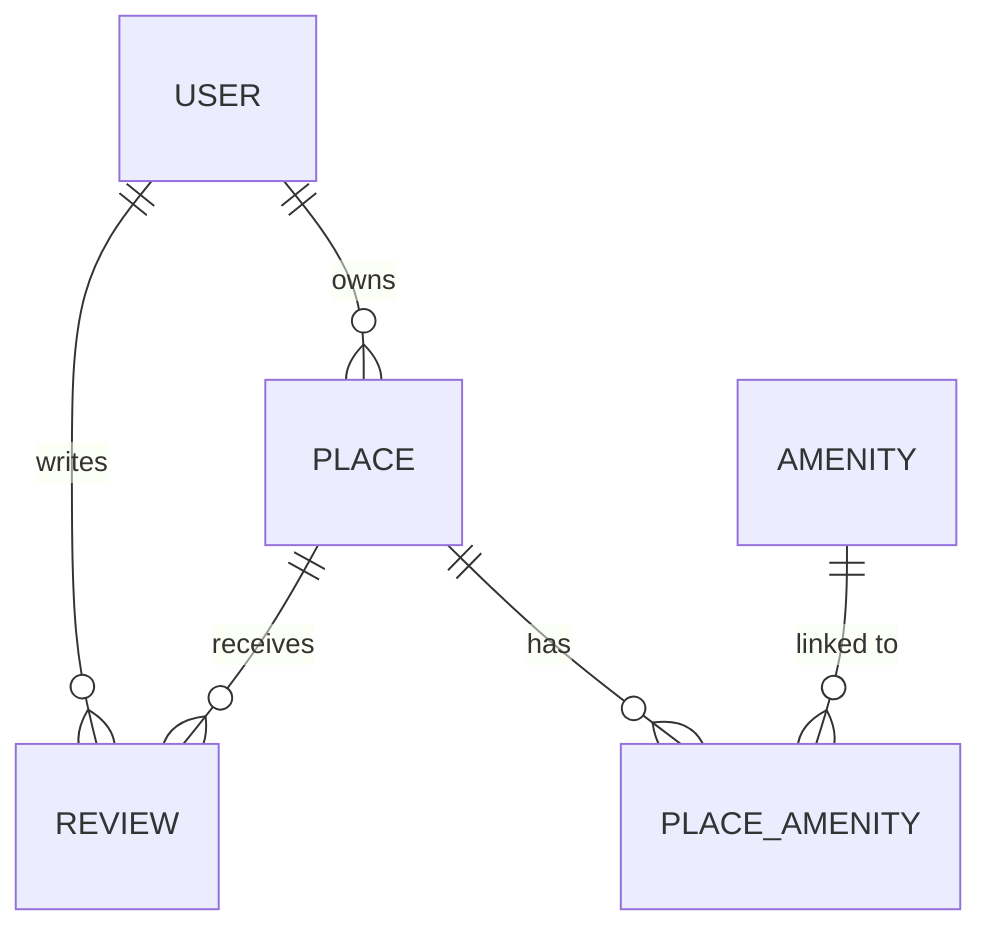

# HBnB API - Part 3

## Description

HBnB API is a modern REST API built with Flask and Flask-RESTX for an Airbnb-like rental platform. This part adds **JWT authentication**, **admin role-based access control (RBAC)**, and **SQLAlchemy ORM persistence** backed by a SQLite database.

## Database Schema

See [`scripts/er_diagram.md`](scripts/er_diagram.md) for the full **Entity-Relationship diagram** (Mermaid.js).

Quick overview:



## Architecture

The project uses a layered architecture with the Facade pattern:

```
app/
├── __init__.py              # Flask configuration and initialization
├── api/v1/                  # REST API endpoints (JWT-secured)
│   ├── auth.py             # JWT login endpoint
│   ├── users.py            # User management
│   ├── places.py           # Place management
│   ├── reviews.py          # Review management
│   └── amenities.py        # Amenity management
├── models/                  # SQLAlchemy ORM models
│   ├── base_model.py       # Base class (id, created_at, updated_at)
│   ├── user.py             # User model (bcrypt password, is_admin)
│   ├── place.py            # Place model (owner FK, amenities M:N)
│   ├── review.py           # Review model (place FK, user FK)
│   └── amenity.py          # Amenity model + place_amenity join table
├── persistence/             # Persistence layer
│   └── repository.py       # SQLAlchemyRepository
└── services/               # Business services
    └── facade.py           # Facade for data access

scripts/
├── schema.sql              # CREATE TABLE statements
├── initial_data.sql        # Admin user + default amenities
└── er_diagram.md           # Mermaid.js ER diagram
```

## Features

### User Management
- User creation with email validation
- User information retrieval
- Profile updates
- Data validation (first name, last name, email)

### Place Management
- Property creation and management
- Owner association
- Amenity management
- Geolocation and detailed information

### Review Management
- Rating and comment system
- User-place association
- Review data validation

### Amenity Management
- Service/amenity creation and management
- Place association
- Reusable amenity catalog

## Technologies Used

- **Python 3.8+**
- **Flask 3.0.2** - Web framework
- **Flask-RESTX** - Extension for REST API and Swagger documentation
- **Flask-JWT-Extended** - JWT authentication (`@jwt_required`, admin claims)
- **Flask-Bcrypt** - Secure password hashing
- **Flask-SQLAlchemy** - ORM for SQLite persistence
- **SQLite** - Embedded database (`instance/development.db`)
- **UUID** - Unique identifier generation
- **Datetime** - Timestamp management

## Installation and Configuration

### 1. Prerequisites
```bash
python3 -m venv hbnb_env
source hbnb_env/bin/activate   # Linux/Mac
# or
hbnb_env\Scripts\activate      # Windows
```

### 2. Dependencies Installation
```bash
pip install -r requirements.txt
```

### 3. Database Initialisation (optional — SQLAlchemy auto-creates tables)
```bash
# Create schema + seed admin user and default amenities
sqlite3 instance/development.db < scripts/schema.sql
sqlite3 instance/development.db < scripts/initial_data.sql
```

Default admin credentials seeded by `initial_data.sql`:

| Field | Value |
|---|---|
| email | `admin@hbnb.io` |
| password | `admin1234` |
| is_admin | `true` |

### 4. Configuration
The `config.py` file contains necessary configurations:
- Development configuration with DEBUG enabled
- SQLite URI: `sqlite:///development.db`
- JWT secret key via environment variable or default fallback

## Server Startup

```bash
python run.py
```

The API will be accessible at `http://localhost:5000`

## API Documentation

Once the server is running, Swagger documentation is available at:
- **Swagger Interface**: `http://localhost:5000/`
- **OpenAPI Specification**: `http://localhost:5000/swagger.json`

## Main Endpoints

### Users (`/api/v1/users`)
- `POST /` - Create a user
- `GET /` - List all users  
- `GET /{id}` - Retrieve a user
- `PUT /{id}` - Update a user

### Places (`/api/v1/places`)
- `POST /` - Create a place
- `GET /` - List all places
- `GET /{id}` - Retrieve a place
- `PUT /{id}` - Update a place

### Reviews (`/api/v1/reviews`)
- `POST /` - Create a review
- `GET /` - List all reviews
- `GET /{id}` - Retrieve a review
- `PUT /{id}` - Update a review
- `DELETE /{id}` - Delete a review

### Amenities (`/api/v1/amenities`)
- `POST /` - Create an amenity
- `GET /` - List all amenities
- `GET /{id}` - Retrieve an amenity
- `PUT /{id}` - Update an amenity

## Testing

Run tests:
```bash
python -m pytest
# or
python test_app.py
python test_hbnb.py
```

## Usage Examples

### Create a user
```bash
curl -X POST http://localhost:5000/api/v1/users \
  -H "Content-Type: application/json" \
  -d '{
    "first_name": "John",
    "last_name": "Doe", 
    "email": "john.doe@example.com"
  }'
```

### Create a place
```bash
curl -X POST http://localhost:5000/api/v1/places \
  -H "Content-Type: application/json" \
  -d '{
    "title": "Cozy apartment",
    "description": "A beautiful apartment in the city center",
    "price": 100.0,
    "latitude": 37.7749,
    "longitude": -122.4194,
    "owner_id": "user-uuid-here"
  }'
```

## Development

### Code Structure
- **Models**: Inherit from `BaseModel` with automatic ID and timestamp management
- **API**: Uses Flask-RESTX for validation and automatic documentation
- **Services**: Facade pattern to centralize business logic
- **Persistence**: In-memory repository (easily extensible for database)

### Data Validation
- Automatic model validation via Flask-RESTX
- Custom validation in models (email, field length)
- Appropriate HTTP error handling

## Future Enhancements

- [x] Database integration (SQLAlchemy + SQLite)
- [x] Authentication and authorization (JWT + bcrypt)
- [ ] Image upload for places
- [ ] Reservation / Booking system
- [ ] Advanced filters and search
- [ ] Pagination
- [ ] Redis cache
- [ ] Complete unit tests

## License

This project is part of the Holberton School program.

## Contributors

- ### **Nabil Zinini**
- Github : https://github.com/zinininabil-stack

- ### **Théo Caulet**
- Github : https://github.com/theocaulet