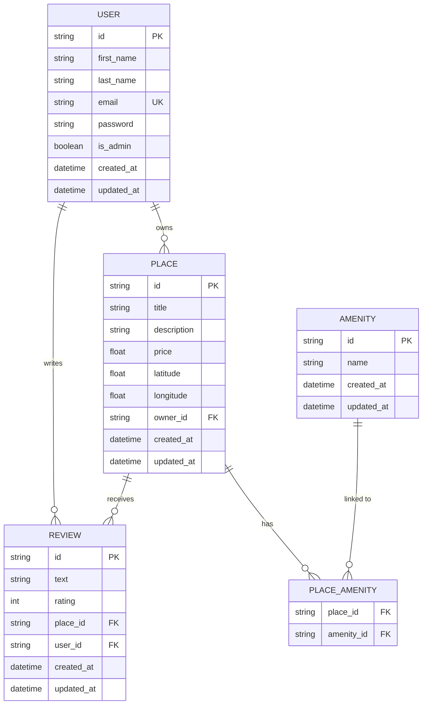
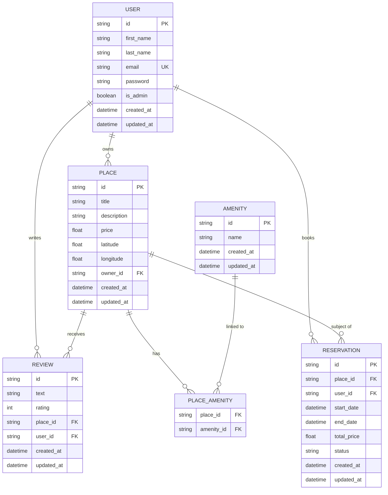

# HBnB – Entity-Relationship Diagram

## Overview

This ER diagram represents the full database schema for the HBnB project (Part 3).  
It maps every SQLAlchemy model to its SQL table and shows all relationships:
one-to-many (`User → Places`, `User → Reviews`, `Place → Reviews`) and  
many-to-many (`Place ↔ Amenity` via the `PLACE_AMENITY` join table).

---

## Diagram (Mermaid.js)

---

## Relationship Summary

| Relationship | Type | Description |
|---|---|---|
| `USER` → `PLACE` | One-to-Many | A user can own multiple places; each place has exactly one owner (`owner_id FK`) |
| `USER` → `REVIEW` | One-to-Many | A user can write multiple reviews; each review belongs to one user (`user_id FK`) |
| `PLACE` → `REVIEW` | One-to-Many | A place can have multiple reviews; each review targets one place (`place_id FK`) |
| `PLACE` ↔ `AMENITY` | Many-to-Many | A place can offer many amenities; an amenity can be shared across many places — resolved via `PLACE_AMENITY` join table |

### Business Rules encoded in the schema
- `email` is `UNIQUE` on `USER` — no two accounts share the same address
- `REVIEW` has a composite `UNIQUE(user_id, place_id)` — one review per user per place
- A `REVIEW`'s `rating` is constrained `CHECK (rating BETWEEN 1 AND 5)`
- `PLACE_AMENITY` uses a composite primary key `(place_id, amenity_id)` — prevents duplicate links

---

## Extended Diagram — with Reservation (bonus)

The section below shows how a future `RESERVATION` entity would integrate:

> **Note**: `RESERVATION` links a `USER` (guest) to a `PLACE` with a date range and
> computed `total_price`. `status` can be `pending`, `confirmed`, or `cancelled`.
> This is entirely additive — no existing table needs modification.
